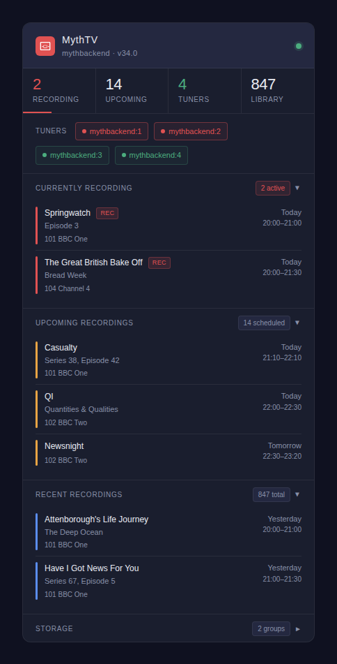

# MythTV Home Assistant Integration

[![HACS Custom][hacs-badge]][hacs-url]
[![GitHub Release][release-badge]][release-url]
[![HA min version][ha-badge]][ha-url]
[![License][license-badge]](LICENSE)

[hacs-badge]: https://img.shields.io/badge/HACS-Custom-orange.svg
[hacs-url]: https://hacs.xyz
[release-badge]: https://img.shields.io/github/release/bangadrum/mythtv-homeassistant.svg
[release-url]: https://github.com/bangadrum/mythtv-homeassistant/releases
[ha-badge]: https://img.shields.io/badge/HA-2023.1%2B-blue.svg
[ha-url]: https://www.home-assistant.io
[license-badge]: https://img.shields.io/github/license/bangadrum/mythtv-homeassistant.svg

A custom integration for [Home Assistant](https://www.home-assistant.io/) that connects to a **MythTV** backend via the [MythTV Services API](https://wiki.mythtv.org/wiki/Category:Services_API), exposing backend status, recordings, encoders, and storage as sensors and binary sensors. Includes a Lovelace dashboard card.



> **MythTV v34 users:** Recording status codes changed completely between v31–v33 and v34. Version 0.4.4 uses codes verified against a live v34 backend. See [info.md](info.md) for the full reference.

---

## Installation

### Via HACS (recommended)

[](https://my.home-assistant.io/redirect/hacs_repository/?owner=bangadrum&repository=mythtv-homeassistant&category=integration)

1. Click the button above, **or** in HACS → ⋮ → **Custom repositories** → add `https://github.com/bangadrum/mythtv-homeassistant` → **Integration**.
2. Install **MythTV**.
3. Restart Home Assistant.

### Manual

1. Download the [latest release](https://github.com/bangadrum/mythtv-homeassistant/releases/latest).
2. Copy `custom_components/mythtv/` into your `<config>/custom_components/` directory.
3. Restart Home Assistant.

---

## Configuration

[](https://my.home-assistant.io/redirect/config_flow_start/?domain=mythtv)

Or go to **Settings → Devices & Services → Add Integration → MythTV** and enter:

| Field | Default | Description |
|---|---|---|
| Host | — | IP address or hostname of the MythTV backend |
| Port | `6544` | Services API port |
| Upcoming recordings to track | `10` | Records fetched per poll (1–50) |
| Recent recordings to track | `10` | Library entries fetched per poll (1–50) |

---

## Entities

### Binary Sensors

| Entity | Device Class | Description |
|---|---|---|
| `binary_sensor.mythtv_backend_connected` | Connectivity | Backend is reachable |
| `binary_sensor.mythtv_currently_recording` | Running | Any tuner is actively recording |
| `binary_sensor.mythtv_recording_conflicts` | Problem | Scheduling conflicts exist |
| `binary_sensor.mythtv_all_encoders_busy` | Occupancy | Every tuner is in use |

### Sensors

| Entity | Description |
|---|---|
| `sensor.mythtv_backend_hostname` | Backend hostname + version (diagnostic) |
| `sensor.mythtv_active_recordings` | Count + details of active recordings |
| `sensor.mythtv_next_recording` | Title of next scheduled recording |
| `sensor.mythtv_next_recording_start` | Timestamp of next recording |
| `sensor.mythtv_upcoming_recordings` | Total upcoming recording count |
| `sensor.mythtv_total_recordings` | Library size |
| `sensor.mythtv_last_recorded` | Most recently recorded title |
| `sensor.mythtv_recording_schedules` | Number of recording rules |
| `sensor.mythtv_recording_conflicts` | Conflict count + programme list |
| `sensor.mythtv_total_encoders` | Encoder count + per-tuner state |
| `sensor.mythtv_storage_groups` | Storage group count + free space per group |

All sensors expose rich data in `extra_state_attributes` — viewable in **Developer Tools → States**.

> **Storage note:** `Myth/GetStorageGroupDirs` reports free space (`KiBFree`) but not total or used space. Free space is the only storage metric available from the MythTV Services API.

---

## Lovelace Card

`mythtv-card.js` is a custom Lovelace card bundled in this repository. It must be installed **manually** — HACS does not install it automatically when you install the integration.

**Step 1** — download `mythtv-card.js` from the [latest release](https://github.com/bangadrum/mythtv-homeassistant/releases/latest) and copy it to `<config>/www/mythtv-card.js`.

**Step 2** — register the resource in **Settings → Dashboards → Resources**:
```yaml
resources:
  - url: /local/mythtv-card.js
    type: module
```

**Step 3** — add to a dashboard:
```yaml
type: custom:mythtv-card
title: MythTV
```

All entity IDs default to the names created by this integration. Override only if yours differ:
```yaml
type: custom:mythtv-card
title: MythTV
connected_entity:        binary_sensor.mythtv_backend_connected
recording_entity:        binary_sensor.mythtv_currently_recording
conflicts_binary_entity: binary_sensor.mythtv_recording_conflicts
conflicts_entity:        sensor.mythtv_recording_conflicts
active_count_entity:     sensor.mythtv_active_recordings
upcoming_entity:         sensor.mythtv_upcoming_recordings
recorded_entity:         sensor.mythtv_total_recordings
encoders_entity:         sensor.mythtv_total_encoders
storage_entity:          sensor.mythtv_storage_groups
hostname_entity:         sensor.mythtv_backend_hostname
```

---

## Requirements

- Home Assistant 2023.1 or later
- MythTV v34 (status codes verified against v34; see [info.md](info.md) for version history)
- `mythbackend` reachable from the HA host on port 6544

---

## API Endpoints Used

| Endpoint | Purpose |
|---|---|
| `Myth/GetHostName` | Connectivity test; returns `{"String": "<hostname>"}` |
| `Myth/GetBackendInfo` | Version string (`BackendInfo.Build.Version`) |
| `Myth/GetStorageGroupDirs` | Directory free space (`StorageGroupDirList.StorageGroupDirs[].KiBFree`) |
| `Status/GetBackendStatus` | Raw status (diagnostic) |
| `Dvr/GetUpcomingList` | All scheduled + active recordings (`ShowAll=true`) |
| `Dvr/GetRecordedList` | Recorded library |
| `Dvr/GetEncoderList` | Tuner states (`Encoders[].State`: `0` = idle) |
| `Dvr/GetRecordScheduleList` | Recording rules |
| `Dvr/GetConflictList` | Scheduling conflicts |
| `Dvr/RecStatusToString` | Status code lookup (used for verification) |

Data is refreshed every **60 seconds** using a parallel `asyncio.gather` call.

---

## Example Automations

### Notify when a recording starts
```yaml
automation:
  - alias: "MythTV recording started"
    trigger:
      - platform: state
        entity_id: binary_sensor.mythtv_currently_recording
        to: "on"
    action:
      - service: notify.mobile_app_your_phone
        data:
          title: "🔴 MythTV Recording"
          message: >
            Now recording:
            {{ state_attr('binary_sensor.mythtv_currently_recording', 'titles') | join(', ') }}
```

### Alert on scheduling conflicts
```yaml
automation:
  - alias: "MythTV conflict alert"
    trigger:
      - platform: state
        entity_id: binary_sensor.mythtv_recording_conflicts
        to: "on"
    action:
      - service: persistent_notification.create
        data:
          title: "MythTV Scheduling Conflict"
          message: >
            {{ state_attr('binary_sensor.mythtv_recording_conflicts', 'conflict_count') }}
            conflict(s) detected:
            {{ state_attr('binary_sensor.mythtv_recording_conflicts', 'conflicts')
               | map(attribute='title') | join(', ') }}
```

---

## Troubleshooting

**Integration shows unavailable** — confirm `mythbackend` is running and reachable. Check HA logs under `custom_components.mythtv`.

**All encoders / recordings show 0** — enable debug logging:
```yaml
logger:
  logs:
    custom_components.mythtv: debug
```

**Storage shows no data** — ensure `mythbackend` has storage groups configured (MythTV Setup → Storage Groups).

---

## Status Code Reference

See [info.md](info.md) for the complete recording status code table, the active recording set, and the history of how codes changed between MythTV versions.

---

## Changelog

### 0.4.4
- **Fixed recording detection for MythTV v34.** Status codes changed completely
  between v31–v33 and v34. All codes were verified via `Dvr/RecStatusToString`
  on a live v34 backend:
  - `Recording` (active): was `-6`, now **`-2`**
  - `WillRecord`: was `8`, now **`-1`**
  - `Conflicting`: was `-2`, now **`7`**
  - `Tuning`: `-10` (unchanged)
  - `Pending`: `-15` (unchanged)
- `ACTIVE_RECORDING_STATUSES` corrected to `{-2, -8, -10, -14, -15}`
- `WILL_RECORD_STATUS` constant added (`-1`); coordinator WillRecord filter updated
- Card `progStatusClass()` updated to v34 codes
- Debug logging removed from coordinator
- `info.md` added: complete status code reference with version history

### 0.4.3
- Fixed root cause of recording display bugs: `GetUpcomingList` called with
  `ShowAll=true`; response split into `currently_recording` (active statuses)
  and `upcoming_programs` (WillRecord only) in coordinator

### 0.4.2
- Fixed active recordings not showing (`ShowAll=true`)
- Fixed card showing wrong status bar class for numeric-string status codes

### 0.4.1
- Fixed manifest.json: removed invalid `homeassistant` key

### 0.4.0
- HACS compliance: moved files to `custom_components/mythtv/`
- Added `hacs.json`, `brand/icon.png`, `translations/en.json`, `LICENSE`
- Fixed `Myth/GetHostName` response key, storage keys, config flow unique ID

### 0.3.0
- Fixed recording status codes, storage data source, conflict attributes

### 0.2.0
- Initial public release

---

## License

MIT
